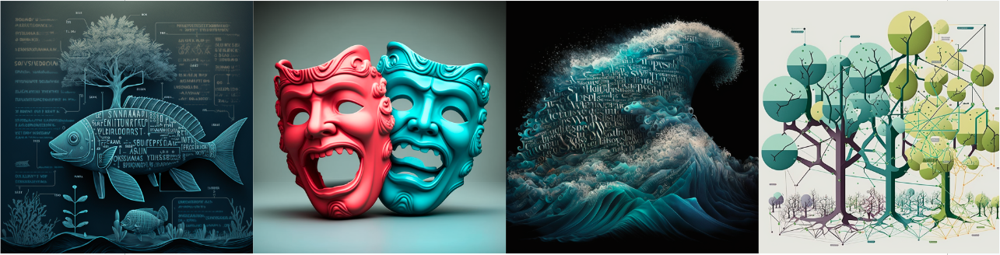

```{r setup, include=FALSE}
knitr::opts_chunk$set(echo = FALSE)

# Learn more about creating websites with Distill at:
# https://rstudio.github.io/distill/website.html

# Learn more about publishing to GitHub Pages at:
# https://rstudio.github.io/distill/publish_website.html#github-pages

```

```{r, out.width = "100%", fig.cap = "Text and sentiment analysis for environmental problems"}

# UPDATE IMAGE HERE
# or copy/paste this code elsewhere, updating the file path, to add other images to your site!

```

## Course description

This course will cover foundations and applications of natural language processing. Problem sets and class projects will leverage common and emerging text-based data sources relevant to environmental problems and will build capacity and experience in common tools, including text processing and classification, semantics, and natural language parsing**.**

## Instructor

Mateo Robbins ([mjrobbins\@ucsb.edu](mailto:mjrobbins@ucsb.edu){.email})

-   **Office:** MEDS Group Office
-   **Office hours:** Monday 1:15pm -2:15pm

## Important links

-   [Link to full course syllabus](https://docs.google.com/document/d/1BxkLEt02rBUl-HcfM7J0rfu0XpnPBOInKAsGBIz2fqc/edit?usp=sharing)

## Weekly course schedule

-   **Lectures:** NCEAS classroom

    M 12:00pm -1:15pm  

    W 11:00am - 12:15pm

## Learning objectives

The goal of EDS 231 (Text and Sentiment Analysis for Environmental Problems) is to expose students to a range of text and sentiment analysis data sources, techniques and tools that can be applied to environmental problems. During this course, students will:

-   Become familiar with the R packages used in text-as-data applications

-   Conduct and explain each step in the text data collection, analysis, and presentation pipeline

## Course requirements

### Computing

-   Minimum MEDS device requirements (bring to all sessions + charger!)

-   Up-to-date R and RStudio

-   Python version 3.x installed (although most, if not all, work will be done in RStudio)

### Textbook

-   Readings will be drawn from free online ebooks:
    -   [Text Mining with R](https://www.tidytextmining.com/) (TMR)
    -   [Supervised Machine Learning for Text Analysis in R](https://smltar.com/) (SMLTAR)

## Topics

| Week | Session | Lecture/Demo                                                                                                    | Reading                                                                                                          | Assignment                                                                                    |
|---------------|---------------|---------------|---------------|---------------|
| 1    | 4/01    | [Course Intro and Text Analysis Overview](https://ucsb.box.com/s/veuptm269uvo3r7hwx1db6u3i114r6xj)              |                                                                                                                  |                                                                                               |
|      | 4/03    | [NYT Lab - Key](https://github.com/MaRo406/EDS-231-text-sentiment/blob/main/Lab1_Demo_key.Rmd)                  | [TMR 1.0-1.3](https://www.tidytextmining.com/tidytext.html), [Appendix A](https://smltar.com/regexp.html#regexp) | [Lab 1](https://github.com/MaRo406/EDS-231-text-sentiment/blob/main/Lab1_InClass.Rmd)         |
| 2    | 4/08    | [Sentiment Analysis I](https://ucsb.box.com/s/pmr1hvyam3zbi2teiq7fzffaaaw3idhq)                                 | [TMR 2.0-2.7](https://www.tidytextmining.com/sentiment.html)                                                     | [In-class demo](https://github.com/MaRo406/EDS-231-text-sentiment/blob/main/Lab2_InClass.Rmd) |
|      | 4/10    | [Sentiment Analysis I Lab - key](https://github.com/MaRo406/EDS-231-text-sentiment/blob/main/Lab2_Demo_key.Rmd) |                                                                                                                  | [Lab 2](https://github.com/MaRo406/EDS-231-text-sentiment/blob/main/Lab2.Rmd)                 |
| 3    | 4/15    | [Topic Analysis Lecture](https://ucsb.box.com/s/cex0cr7wz57b4ccpq3y6r0wj5l31cpw4)                               | [TMR 6.0-6.4](https://www.tidytextmining.com/topicmodeling.html)                                                 |                                                                                               |
|      | 4/17    | [Topic Analysis Lab - key](https://github.com/MaRo406/EDS-231-text-sentiment/blob/main/Lab3_Demo_key.Rmd)       |                                                                                                                  | [Lab 3](https://github.com/MaRo406/EDS-231-text-sentiment/blob/main/Lab3.Rmd)                 |
| 4    | 4/22    | [Classification Lecture](https://ucsb.box.com/s/vjdi55gs7c1fwabsdfo5naegq9j8tuif)                               | [SMLTR 7.1-7.4](https://smltar.com/mlclassification.html#classfirstattemptlookatdata)                            | In-class demo                                                                                 |
|      | 4/24    | [Classification demo cont.](https://github.com/MaRo406/EDS-231-text-sentiment/blob/main/Lab4_Demo_2.Rmd)        |                                                                                                                  | [Lab 4](https://github.com/MaRo406/EDS-231-text-sentiment/blob/main/Lab%204.Rmd)              |
| 5    | 4/29    | Break                                                                                                           |                                                                                                                  |                                                                                               |
|      | 5/01    | Break                                                                                                           |                                                                                                                  |                                                                                               |
| 6    | 5/08    | [Word Embeddings Lecture](https://ucsb.box.com/s/10dfabs8nzxquq4d96c8w6egxu7sei7w)                              | [SMLTR 5.1-5.7](https://smltar.com/embeddings.html#glove)                                                        |                                                                                               |
|      | 5/10    | Word Embeddings Lab                                                                                             |                                                                                                                  | Lab 5                                                                                         |
