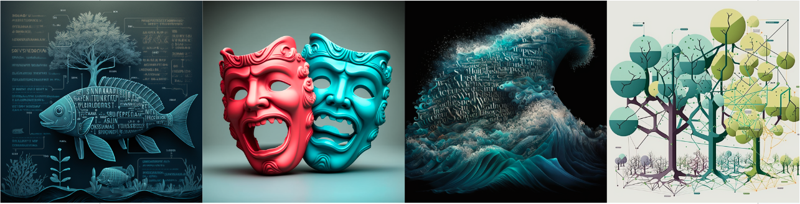

```{r setup, include=FALSE}
knitr::opts_chunk$set(echo = FALSE)

```

```{r, out.width = "100%", fig.cap = "Text and sentiment analysis for environmental problems"}

# UPDATE IMAGE HERE

```

## Course description

This course will cover foundations and applications of natural language processing. Problem sets and class projects will leverage common and emerging text-based data sources relevant to environmental problems, including policy documents, public comments, scientific literature, and social media. Methods covered include text processing, sentiment analysis, text classification and topic modeling.

## Instructor

Mateo Robbins ([mjrobbins\@ucsb.edu](mailto:mjrobbins@ucsb.edu){.email})

-   **Office:** Bren Hall 2027
-   **Office hours:** Tuesdays, by appointment

## Important links

-   [Link to full course syllabus](https://ucsb.box.com/s/uac3u01wijh6jxy2k8ndvgpmb885sbcz)

## Weekly course schedule

-   **Class meets:** Bren 1510

    Tuesdays 12:30pm -1:45pm    

## Learning objectives

The goal of EDS 231 (Text and Sentiment Analysis for Environmental Problems) is to expose students to a range of text and sentiment analysis data sources, techniques and tools that can be applied to environmental problems. During this course, students will:

-   Become familiar with the common software packages used in text-as-data applications 

-   Conduct and explain each step in the text data collection, analysis, and presentation pipeline 

-   Evaluate examples of text analysis in the environmental science literature

## Course requirements

### Computing

-   Minimum MEDS device requirements

-   Up-to-date R and RStudio

### Textbook

-   Readings will be drawn from free online ebooks:
    -   [Text Mining with R](https://www.tidytextmining.com/) (TMR)
    -   [Supervised Machine Learning for Text Analysis in R](https://smltar.com/) (SMLTAR)

## Topics

| Week | Topic                                           |
|------|-------------------------------------------------|
| 1    | **Course Intro**                                |
| 2    | **Text Preprocessing and Cleaning**             |
| 3    | **Exploratory Text Analysis and Visualization** |
| 4    | **Lexicon-Based Sentiment Analysis**            |
| 5    | **Topic Modeling I**                            |
| 6    | **Topic Modeling II**                           |
| 7    | **Classification**                              |
| 8    | **Text Representation**                         |
| 9    | **Final project work day**                      | 
| 10   | **Final project presentations**                 |
